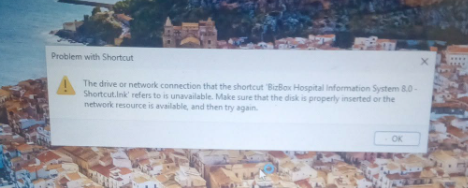

# [Bizbox Shortcut Link Unavailable Everyday in the morning]

**Date:** 2026-09-18
**Category:** Network
**Status:** Resolved

---

## Problem Summary

## Symptoms

* The network does not recognize the user pc everytime the moment after powering on the pc. which means everytime the computer shuts off, the network account always logs out on its own.

**Error Message (if applicable):**

`[Error message]` PROBLEM WITH SHORTCUT

---

## Investigation

Document the troubleshooting process and what you discovered.

### Step 1 — [RESTARTED THE COMPUTER]

RESTARTED THE COMPUTER TO CHECK THE THEORY IF ITS TRUE

**Result:** [CONFIRMED THAT IT WAS THE CASE]

---

## Root Cause

Most likely cause: [This happens because mapped connection to 172.16.1.2 isn't persistent and  credentials aren't saved. Windows drops the session on shutdown, and on the next boot it tries to reconnect before it has stored login info, so the shortcut fails until manually authenticate again.]

---

## Resolution

[Describe what was done to resolve the issue.]

1. Open command prompts as administrator
2. run cmdkey /add:172.16.1.2 /user:administrator /pass:mypassword
3. net use \\172.16.1.2\yourshare /persistent:yes

---

## Verification

Describe how you confirmed that the issue was successfully resolved.

* [After executing the resolution the error never happened again] — **PASS**

**Final Status:** Resolved

---

## Lessons Learned

[Credentials does not automatically saved on a computer after using net use to access files from a server]

[Include any troubleshooting technique, technical concept, or practical insight that may be useful for future incidents.]

Im smart asfuck I cant explain why t
